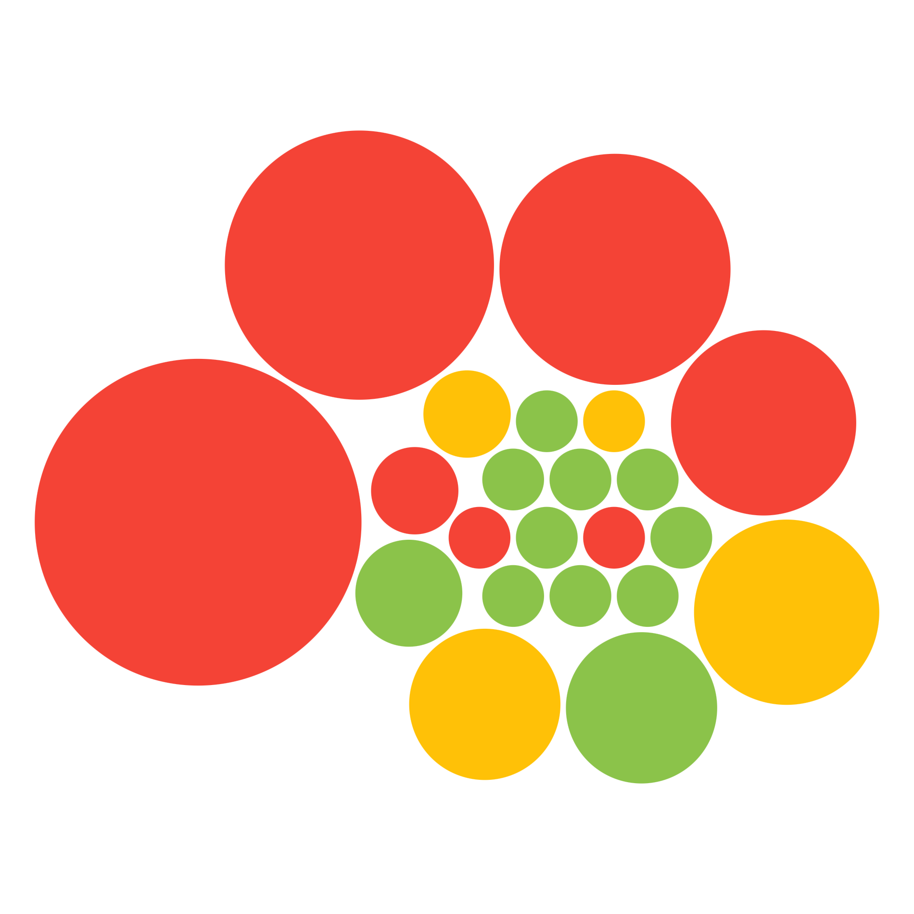
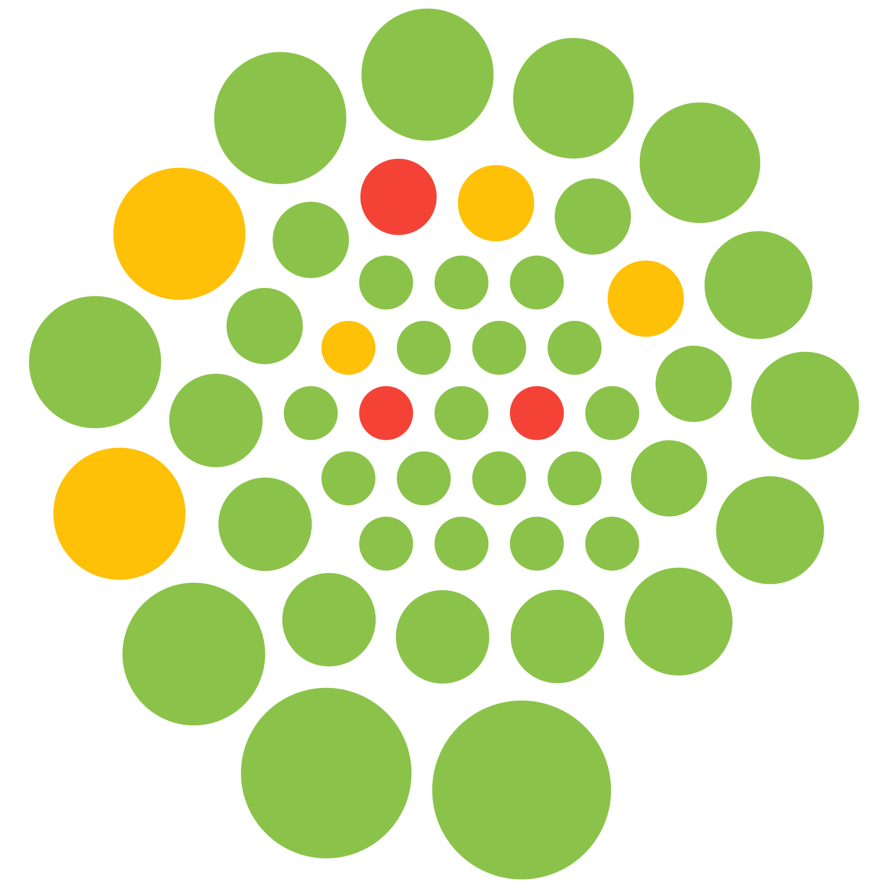
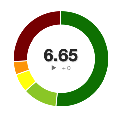
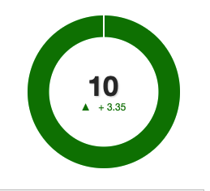

# Me MVC-sida


En personlig Me-sida byggd med Symfony för kursen [MVC](https://dbwebb.se/kurser/mvc-v2).

## Tekniker

- PHP 8+ & Symfony
- Twig
- Composer
- Git & GitHub
- VS Code

## Kom igång

1. Klona repot via terminalen:

    ```bash
    git clone https://github.com/melissa-uzum/me-mvc.git
    cd me-mvc
    ```

2. Installera beroenden:

    ```bash
    composer install
    ```

3. Starta webbservern:

    ```bash
    php -S localhost:8000 -t public
    ```

4. Öppna i webbläsaren:

    ```
    http://localhost:8000
    ```

## Kodkvalitet och Metrics

### Scrutinizer-badges

[](https://scrutinizer-ci.com/g/melissa-uzum/me-mvc/)
[](https://scrutinizer-ci.com/g/melissa-uzum/me-mvc/)
[](https://scrutinizer-ci.com/g/melissa-uzum/me-mvc/)

---

## Metricsanalys

### Introduktion: 6C för kodkvalitet

Analysen bygger på sex nyckelbegrepp (6C):

- **Codestyle:** Kodstil enligt PSR gjorde koden mer enhetlig.
- **Coverage:** Första bygget hade 19 % testtäckning, förbättrades till 29 %.
- **Complexity:** Klassen `Game21` hade WMC på 52 – ett tydligt tecken på för hög ansvarsmängd.
- **Cohesion:** Flera klasser hade god sammanhållning (låg LCOM), vilket var positivt.
- **Coupling:** `CardController` var starkt kopplad till flera andra klasser – detta påverkade underhållbarheten.
- **CRAP:** Högt CRAP-score identifierade metoder med låg testtäckning och hög komplexitet.

---

### PhpMetrics

Tre identifierade problemområden:

1. **Game21**
   WMC: 52
   CRAP: högt
   → Bröt upp klassen i mindre komponenter (t.ex. `GamePlayer`, `AceHandler`)

2. **CardController**
   Cyclomatic complexity: 19
   → Delegation flyttades till service/responder-klasser

3. **LibraryController**
   516 rader, låg cohesion
   → Planerade omstrukturering för tydligare ansvar

Illustrationer:



---

### Scrutinizer

Första analys:

- **Code Quality Score:** 6.64
- **Test Coverage:** 19 %
- **Kritiska alerts:** 216
- Många kom från `vendor`/Symfony – inte min egen kod.

Efter att jag exkluderade irrelevanta mappar via `.scrutinizer.yml`, fokuserades analysen på `src/` och poängen ökade till **10.00**, samt testtäckning till **29 %**.




---

### Förbättringar

Jag valde att fokusera på dessa tre förbättringsområden:

1. **Bryta upp Game21**
   → Mindre klasser, mindre ansvar → lägre komplexitet

2. **Öka testtäckning**
   → Lade till enhetstester på logik i t.ex. `GameBet` och `Wallet`

3. **Förenkla CardController**
   → Flyttade logik till separata responder- och service-klasser

Förväntat resultat:

- Lägre WMC
- Lägre CRAP
- Färre röda flaggor
- Ökad kodförståelse

---

### Sammanfattning: Före/efter

| Mätvärde                 | Före     | Efter    |
|--------------------------|----------|----------|
| WMC (Game21)             | 52       | 27       |
| Antal klasser            | 22       | 47       |
| Kodkvalitet (Scrutinizer)| 6.64     | 10       |
| Kodtäckning              | 19 %     | 29 %     |
| Cyclomatic Complexity    | Hög      | Medel    |
| Röda bubblor             | Flera    | Färre    |

---

### Diskussion

Det blev väldigt tydligt att gneom förbättringar och att dela upp koden gick poängen upp, sedan upplevde jag att den förbättrade koden är mycket mer renskriven och lätt att underhålla. Jag gillar att Scrutinizer och PhpMetrics ger visualiseringar som gör det lätt att följa sin utveckling. Dessa verktyg kommer givetvis inte säga "Kodens logik är fel" men de visar tex. ifall koden är för komplex, men de gröna bubblorna var ritkigt goa!

Fördelar:

- Mätbara förbättringar
- Visuell feedback
- Tydliga mål

Nackdelar:

- Det krävs tid samt förståelse att tolka rätt
- Måste konfigueras rätt

Andra sätt att jobba med “clean code” är t.ex. att använda **code reviews**, skriva **kommentarer med syfte** och ha en tydlig **mapstruktur**. Redan idag vet jag att ett av mina förbättringsområden är att kommentera samt dokumentera min kod, innan jag började studera på BTH använde jag mig aldrig av kommentarer. Nu tvingar jag mig själv att använda de för att det ska bli en god vana. Att alltid hålla sig uppdaterad och att alltid testa kodens funktionalitet häjlper även, i detta kmom såg jag till att alltid testa olikad elar av min sida för att see att allt fungerar som tänkt.


## Projekt: Hållbarhet

Detta projekt syftar till att visualisera indikatorer för hållbar utveckling, med fokus på klimat och vatten.

### Funktioner

- Visualisering av CO₂-utsläpp och tillgång till rent vatten för Sverige och Danmark.
- Interaktiva diagram med Chart.js.
- JSON API med GET- och POST-endpoints.
- Knapp för att återställa data till ursprungsläget (2015–2020).
- ORM via Doctrine och flera aktiva databasanslutningar.

### Använda sidor

- [Startsida för projektet](/proj)
- [Om projektet](/proj/about)
- [API-dokumentation och test](/proj/api)
- [Databassida med ER-diagram](/proj/about/database)
- [Avancerade tekniska features](/proj/features)

### Teknisk info

- Databasen för projektet är MariaDB och används tillsammans med Doctrine ORM.
- ER-diagram och tabellbeskrivningar återfinns på databassidan.
- Projektet har en helt separat layout, navbar och CSS-justering jämfört med me-sidan.

Projektet finns under `proj/` och uppfyller krav 1, 2, 3 samt samtliga optionella krav (4, 5, 6).


---

## Licens

MIT
