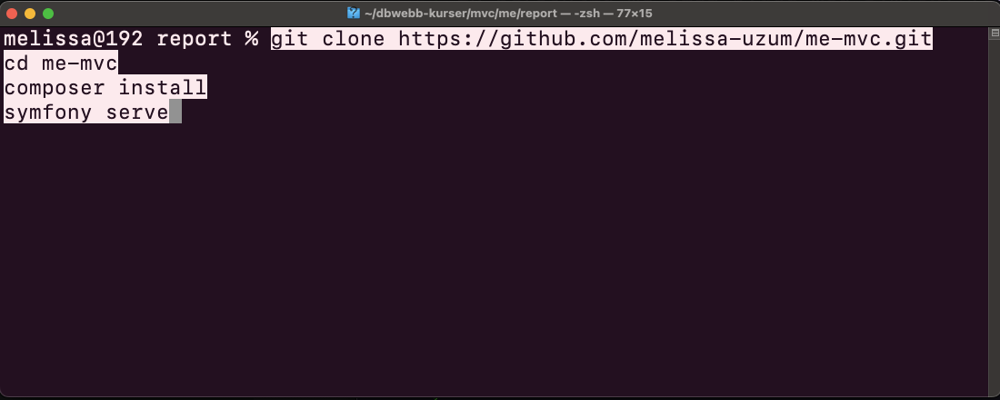

# Me MVC-sida



En personlig Me-sida byggd med Symfony för kursen [MVC](https://dbwebb.se/kurser/mvc-v2).

## Tekniker

- PHP 8+ & Symfony
- Twig
- Composer
- Git & GitHub
- VS Code

## Kom igång

1. Klona repot via terminalen:

    ```bash
    git clone https://github.com/melissa-uzum/me-mvc.git
    cd me-mvc
    ```

2. Installera beroenden:

    ```bash
    composer install
    ```

3. Starta webbservern:

    ```bash
    php -S localhost:8000 -t public
    ```

4. Öppna i webbläsaren:

    ```
    http://localhost:8000
    ```

